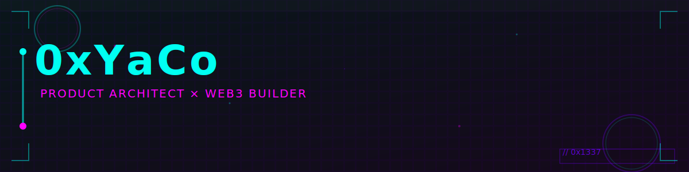

  <a href="./README.zh.md">🌐 中文版</a> | <strong>EN</strong>

<picture>
  <source media="(prefers-color-scheme: dark)" srcset="./assets/dark-header.svg">
  <source media="(prefers-color-scheme: light)" srcset="./assets/light-header.svg">
  
</picture>

---

## ▸ SECTOR_01 // IDENTITY

**0xYaCo** · Product Architect · Security Researcher · Web3 Builder

📍 Hangzhou, China · UTC+8
🌐 Web3 × Security × Code × Game Design

---

## ▸ SECTOR_02 // CURRENT FOCUS

> Building products that matter. Shipping code with impact.

### 🔥 Featured Projects

| Project | Description | Stack |
|---------|-------------|-------|
| **[CurveCraft](https://github.com/OS-Lihua/CurveCraft)** | 🎨 Decentralized Bonding Curve DeFi Tool | Solidity · React · Foundry |
| **[BettaFish 微舆](https://github.com/OS-Lihua/BettaFish)** | 📊 Multi-Agent Sentiment Analysis (30+ Platforms) | Python · BERT · Flask |
| **[neoxsend](https://github.com/OS-Lihua/neoxsend)** | 🔐 Secure On-Chain Random Service | Solidity · Foundry |
| **[AP2](https://github.com/OS-Lihua/AP2)** | 🤖 AI Agent Payment Protocol | Python · Gemini API |

---

## ▸ SECTOR_03 // SKILL MATRIX

<!-- SKILLS:START -->
| Language | Commits | Proficiency | Progress |
|----------|---------|-------------|----------|
| C++ | 82 | ⭐⭐⭐⭐⭐ | `████████████░░` |
| Solidity | 61 | ⭐⭐⭐⭐ | `██████████░░░░` |
| Go | 34 | ⭐⭐⭐ | `██████░░░░░░░░░░` |
| Python | 28 | ⭐⭐⭐ | `█████░░░░░░░░░░░░` |
| TypeScript | 21 | ⭐⭐ | `████░░░░░░░░░░░░░░░░` |
| Rust | 18 | ⭐⭐ | `███░░░░░░░░░░░░░░░░░░░░` |

<!-- SKILLS:END -->

### Tech Stack

**Languages**: C++ · Solidity · Go · Python · TypeScript · Rust · Bash · JavaScript
**Blockchain**: Solidity · Foundry · Hardhat · Web3.js · Ethers.js
**Backend**: Flask · FastAPI · gRPC · PostgreSQL · Redis
**Frontend**: React · Next.js · TypeScript · Tailwind CSS
**DevOps**: Docker · GitHub Actions · AWS · Vercel
**Tools**: Git · VS Code · Vim · CMake · Make

---

## ▸ SECTOR_04 // STATS

---

## ▸ SECTOR_05 // ACHIEVEMENTS

---

## ▸ SECTOR_06 // CONNECT

---

  

---

**Let's build something extraordinary together.** 🚀

  Last updated: <em>auto-refreshed daily</em> | Made with 💻 + ✨

